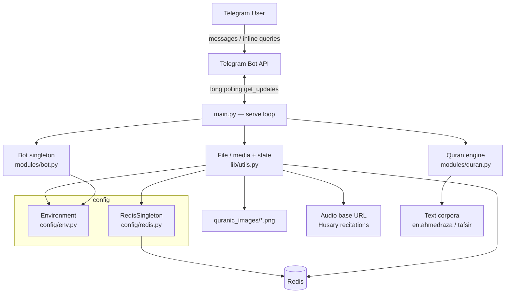
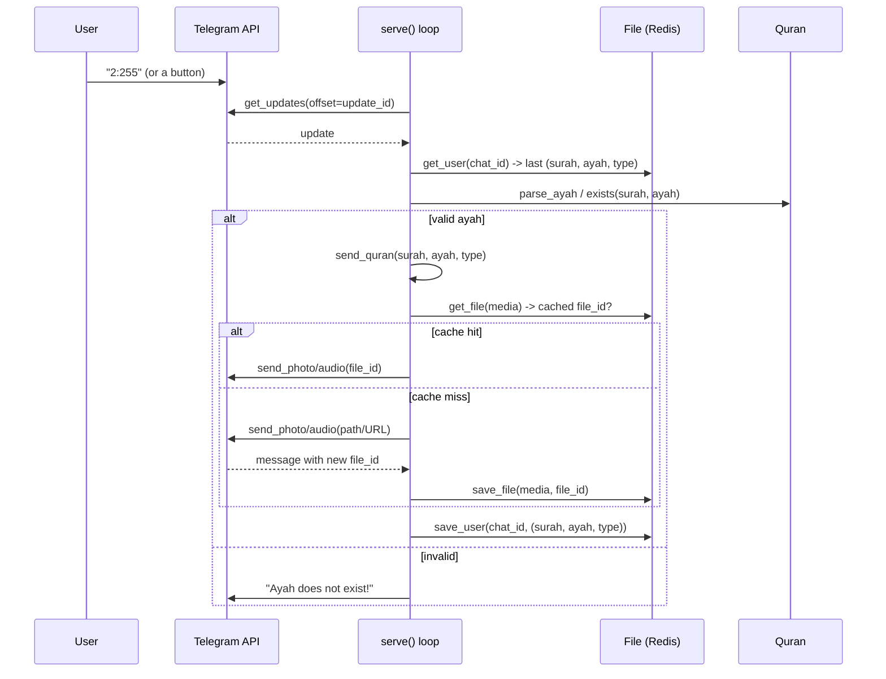

# BismillahBot — Business Logic

> A Telegram bot that lets users explore the Holy Qur'an: English translation,
> Arabic ayah images, audio recitation, and tafsir — via chat commands or
> Telegram inline queries in any chat.

---

## 1. Overview

BismillahBot answers a user with a specific ayah (verse) of the Qur'an in one of
four representations:

| Type      | Delivery              | Source                                             |
| --------- | --------------------- | -------------------------------------------------- |
| `english` | Text message          | `en.ahmedraza` (Imam Ahmed Raza, tanzil.net)       |
| `tafsir`  | Text message          | Tafsir al-Jalalayn (`Al_Jalalain_Eng.txt`)         |
| `arabic`  | Photo (rendered ayah) | `quranic_images/{surah}_{ayah}.png`                |
| `audio`   | Audio file            | Husary recitation (`AUDIO_BASE_URL/.../SSSAAA.mp3`) |

The bot remembers each user's **last position** (surah, ayah, type) for 2 days,
so navigation buttons (Previous / Next / Random) and type switches operate
relative to where the user currently is.

---

## 2. Architecture



### Module responsibilities

- **`main.py`** — entrypoint & long-poll loop. Parses updates, routes commands,
  keyboard buttons and `surah:ayah` references, and dispatches sends.
- **`modules/quran.py`** — the `Quran` corpus (parsing, lookup, navigation math,
  bounds checks) plus the `/index` renderer.
- **`modules/bot.py`** — lazily-constructed singleton `telegram.Bot`.
- **`lib/utils.py`** — `File`: user-state persistence, Telegram file-id cache,
  and media path/URL resolution.
- **`config/`** — environment access (`Environment`) and the Redis connection
  singleton (`RedisSingleton`).

---

## 3. Request lifecycle



### Routing rules (in `serve`)

1. **Inline query** → for a valid reference, answer with all four
   representations: translation, tafsir, recitation, and the rendered Arabic
   image(s). A **range** (`59:22-24`) is answered as a range in every one of them
   — joined text, and a single stitched audio file, not just the first ayah. For
   anything else, a reciter-name search, falling back to a curated set of default
   ayahs. Both branches are `is_personal` and short-cached — every result is
   rendered from the caller's settings and must not be served from a shared cache.

   Inline results can only carry a `file_id` or a URL Telegram fetches itself,
   never an upload, which decides where each medium comes from:

   | Result           | Source                                                        |
   | ---------------- | ------------------------------------------------------------- |
   | Single-ayah audio | `AUDIO_BASE_URL` directly — already a public URL              |
   | Range audio      | the cached `file_id` from an in-chat send, else `/media/range.mp3` on this app, which stitches on demand |
   | Arabic image     | the cached `file_id` from an in-chat send, else `PHOTO_BASE_URL` (the renders are PNG and the Bot API documents inline photo URLs as JPEG, so the cached path is the dependable one) |

   Each is dropped from the answer rather than offered broken when its source is
   unavailable (reciter gone from the catalog, base URL pointing at a local path,
   range past `MAX_RANGE_AYAHS`).
2. **Non-text / group chats** (`chat_id < 0`) → ignored.
3. **`/command`** → `start`/`help`, `about`, `index`, `random`.
4. **Keyboard type words** (`english`/`tafsir`/`audio`/`arabic`) → resend the
   current ayah in that representation.
5. **`next`/`previous`/`random`** → move position, then resend in current type.
6. **`surah:ayah` reference** → validate & send as an inline **verse card** (the
   verse plus an inline keyboard attached to the message).
7. **Callback tap** (`vc:`/`vr:`/`showlang`/`setlang:`/`setreciter:`/`recpage:`) →
   for the text views, edit
   the verse card **in place** (`editMessageText`) so navigation doesn't post a new
   message; media views (arabic/audio) and text↔media switches send a fresh card.
   `showlang` opens the language picker; `setlang:` stores the choice. `recpage:`
   turns a page of the reciter picker by swapping only its keyboard
   (`editMessageReplyMarkup`), so paging the ~80-entry catalog never posts a new
   list. Pages wrap, so neither arrow is ever dead. The old
   persistent reply keyboard is retired (typed type-words in rule 4 still work as a
   fallback for anyone who still has it).

---

## 4. Navigation model

Position is a `(surah, ayah, quran_type)` tuple stored per `chat_id` in Redis.

```mermaid
stateDiagram-v2
    [*] --> Default: no stored state -> (1, 1, english)
    Default --> Positioned: user sends surah:ayah
    Positioned --> Positioned: Next / Previous (wraps 114 <-> 1)
    Positioned --> Positioned: Random
    Positioned --> Positioned: switch type (arabic/audio/english/tafsir)
    Positioned --> [*]: state expires after 2 days
```

- `get_next_ayah` / `get_previous_ayah` wrap around the 114 surahs.
- `exists()` and `surah_lengths` enforce valid bounds (total 6236 ayahs).

### Structural divisions (page / juz / sajda)

Alongside the ayah reader there is a **page reader**, working in the unit people
actually read and memorize in. All of it comes from `quran-data.xml`, which the bot
already shipped: `pages` (604), `juzs` (30), `hizbs` (240), `manzils` (7),
`rukus` (556), `sajdas` (15). Only `suras` was read before.

- `Quran.page_range(n)` / `juz_range(n)` → `(start_surah, start_ayah, end_surah,
  end_ayah)`. A division runs to the ayah before the next one's mark; they tile the
  Qur'an with no gaps or overlaps (asserted in `tests/test_navigation.py`).
- `Quran.page_of(s, a)` / `juz_of(s, a)` bisect the marks — `(surah, ayah)` tuples
  sort in mushaf order, so the containing division is the last mark at or before it.
- **96 of the 604 pages cross a surah boundary**, so page media works on a list of
  `(surah, ayah)` pairs, not a single surah's `(start, end)`. `_download_stitched_audio`
  takes that list; `_download_combined_audio` is now a thin surah-scoped wrapper.
- `/juz N` opens the page reader at that juz's first page rather than trying to be
  one message or one (~20 minute) audio file.
- `hizbs`/`manzils`/`rukus` are parsed and exposed but have no commands yet.

### Page images and page audio

everyayah.com serves **no full-page mushaf image** — only per-ayah renderings — so a
page image is stitched from them (`lib/page_image.py`) using the uniform-width
`quranpngs` set. It is not a facsimile: inter-ayah margins are uneven. Guards: the
result is downscaled to Telegram's `width + height ≤ 10000`, re-encoded as JPEG under
the upload cap, and concurrent stitches are bounded so they cannot exhaust the 512 MB
instance. The upload is cached by `file_id` (`page:<n>`), so a page is stitched once,
not once per reader.

Page audio prefers the reciter's single `PageMp3s/Page<NNN>.mp3`. **19 of the 79
catalog entries have none** (verified by probing the CDN — everyayah's own HTML
listing overstates availability), and those fall back to stitching the page's ayah
recitations. No page exceeds `MAX_RANGE_AYAHS`, so the fallback is always in bounds.

### Audio catalog kinds

`performers.json` entries carry a `kind`: `recitation` (68), `riwayah` (3),
`translation` (8). This is a correctness concern, not cosmetics — a *riwayah* is a
different reading of the text (Warsh vs the Ḥafṣ shown on screen), and a
*translation* entry is not recitation at all but the translated meaning read aloud.
`/reciter` groups by kind under labelled tabs, and choosing a non-`recitation` entry
appends a warning specific to which of the two it is.

**Audio never follows language.** No code path lets `/language` or `/translation`
change which recording is sent; only `/reciter` does. `tests/test_reciter_picker.py`
asserts this directly.

### Repeat (memorization)

`🔁 Repeat ×3` on a verse card sends the ayah recited `REPEAT_COUNT` times back to
back, built by handing `_download_stitched_audio` the same `(surah, ayah)` pair
three times. Cached by `file_id` (`repeat:<n>:<s>:<a>:<reciter>`).

everyayah.com publishes ayah-boundary timing files, and an earlier plan was to use
them for this. They were rejected after measurement: differencing the offsets
overstates every ayah by ~250-300 ms and is 2.3× wrong on the first ayah of a surah
(upstream's own disclaimer says the individual mp3s were re-cut by hand afterwards),
and the 27 zips cover at best 35 of the 79 catalog entries. Repeating an ayah turns
out to need no timing data at all, so the feature is exact for every reciter and
carries no attribution obligation.

### Translation-only catalogue entries

`Language.translation_only` marks entries that are a way to *read* the Qur'an rather
than a language the interface exists in — currently the Latin transliteration.
`UI_LANGUAGES` (everything else) is what needs a complete string table, what
`/language` offers, and what gets a Telegram command menu; `LANGUAGES` is what
`/translation` offers. `normalize_lang` refuses to return a translation-only code,
so no user can end up with an interface that has no strings.

---

## 5. Caching strategy

Two independent Redis-backed caches:

| Cache          | Key                                    | Value                   | TTL    |
| -------------- | -------------------------------------- | ----------------------- | ------ |
| User state     | `{chat_id}`                            | `[surah, ayah, type]`   | 2 days |
| Media file-ids | `file:{path-or-url}`                   | Telegram `file_id`      | 2 days |
| Stitched range | `file:combined:{s}:{a}-{b}:{reciter}`  | Telegram `file_id`      | 2 days |
| Streak graph   | `file:streak_graph_v1_{user}_{date}`   | Telegram `file_id`      | 2 days |
| Wizard draft   | `wizard:{user_id}`                     | JSON `{kind,step,data}` | 30 min |

The media cache avoids re-uploading the same photo/audio: after the first send,
Telegram returns a reusable `file_id` that later sends reference directly. Both
caches are read by the inline path too (see routing rule 1), which is how a range
already sent in a chat is replayed inline without being stitched again.

The streak graph is a pure function of `(user, local date)`, so keying on exactly
those two means a user hammering `/streak` renders once a day. The `v1` in the key
invalidates every cached image at once if the palette or layout changes.

The wizard draft is the one piece of *conversation* state. It is deliberately not
in Postgres: nothing durable is written until a plan is confirmed, so losing a
half-finished `/memorize` on restart costs the user one retype. With
`REDIS_HOST_URL` unset it lives in the in-process `MemoryStore`, which is correct
for a single-worker deployment.

**Everything else the hifz platform stores is Postgres, not Redis** — profiles,
memorized intervals, plans, session history and the send queue. That is a
deliberate split: Redis holds what may be lost, Postgres holds what may not.

---

## 6. Issues fixed in this refactor

| #  | Area                | Problem                                                                 | Fix                                                              |
| -- | ------------------- | ----------------------------------------------------------------------- | --------------------------------------------------------------- |
| 1  | `utils.get_file`    | Read/write used mismatched keys → cache never hit                       | Single `_file_key()` used by both save & get                    |
| 2  | Inline query        | `ayah` reassigned to a string before `get_ayah()` → `TypeError`         | Use a separate `ref` variable for the display string            |
| 3  | Inline query        | `answer_inline_query` not awaited → query never answered                | `await`ed                                                       |
| 4  | `send_file` (audio) | Stray `get_updates()` mid-send consumed/dropped user updates            | Removed                                                         |
| 5  | `get_audio_filename`| `perf` could be undefined (`NameError`); file re-read every request     | Explicit `ValueError`; performers JSON cached in-process        |
| 6  | `serve` loop        | Blocking `time.sleep` stalled the event loop                            | `await asyncio.sleep(...)`                                       |
| 7  | `send_file`         | Telegram v20 `Message` accessed as a dict (`result["photo"]`)           | Attribute access (`result.photo[-1].file_id`)                   |
| 8  | `save_file`         | Dead `message_to_dict` branch + dict/str cache inconsistency            | Cache stores the `file_id` string directly                      |
| 9  | Startup             | `update_id` took the first backlog update → reprocessing                | Start after the most recent (`result[-1].update_id + 1`)        |
| 10 | `Environment`       | `@classmethod` used `self`; rebuilt dict every call; unknown key crash  | Uses `cls`; explicit `KeyError` on unknown names                |
| 11 | `RedisSingleton`    | Not actually a singleton — new connection per instance                  | Real `__new__`-based, thread-safe singleton                     |
| 12 | Regex               | Invalid escape sequences (`\d` in non-raw strings)                      | Raw strings                                                     |
| —  | Cleanup             | Debug `print`s in hot paths; wrong chat action for audio                | Removed prints; `UPLOAD_VOICE`                                   |

---

## 7. Known limitations / tech debt

- **Corpora parsed on every startup** from text files; no precomputed/JSON cache
  loaded at boot (`save_json` exists but is unused).
- **`arabic` Quran text** requires `quran-uthmani.txt`, which is not needed for
  the image-based Arabic delivery but is still referenced in `Quran.__init__`.
- **No structured logging / metrics** — only `print` statements remain for
  request tracing.
- **Single-process long polling** — no horizontal scaling; one bot instance.
- **No automated tests**.

---

## 8. Future roadmap

```mermaid
flowchart LR
    subgraph Phase 1 — Stabilize
      A1[Add unit tests\nnavigation + parsing]
      A2[Structured logging]
      A3[Precompiled corpora cache]
    end
    subgraph Phase 2 — Scale
      B1[Webhook mode\ninstead of long polling]
      B2[Async media prefetch]
      B3[Config validation on boot]
    end
    subgraph Phase 3 — Features
      C1[Multiple translations & reciters]
      C2[Bookmarks / favorites]
      C3[Daily ayah subscription ✔]
      C4[Full-text ayah search]
    end
    subgraph Phase 4 — Platform
      D1[Multi-language UI]
      D2[Analytics dashboard]
      D3[Rate limiting / abuse controls]
    end
    A1 --> B1 --> C1 --> D1
    A3 --> B2
    A2 --> D2
```

### Prioritized backlog

1. **Testing & CI** — cover `parse_ayah`, `get_next/previous_ayah`, bounds, and
   the cache round-trip; add a lint/compile gate.
2. **Webhook delivery** — replace long polling for lower latency and easier
   horizontal scaling.
3. **Reciter & translation selection** — expose `performers.json` choices and
   multiple translations as user preferences (already partially modeled).
4. ~~**Daily ayah subscriptions** — scheduled push of an ayah to opted-in users.~~
   **Shipped** as the hifz platform: `/memorize` builds a dated plan and an
   in-process asyncio loop drains a Postgres due-queue (`scheduled_send`) at each
   user's own local reminder time, idempotent across restarts. See §9.
5. **Ayah search** — search translations/tafsir by keyword and return references.
6. **Observability** — structured logs, per-command metrics, error alerting.
7. **Config hardening** — validate all required env vars at startup and fail fast.

---

## 9. The hifz platform

Turning the reader into a memorization companion added seven commands, three
wizards, a background scheduler and a second storage aggregate. The pieces that
are not obvious from the code:

### The seam (`src/hifz/`)

`handle_update` grew one `elif command == ...` at a time and was 378 lines before
this work. Adding seven more commands inline would have doubled it. Instead each
feature is a module under `src/hifz/` that registers itself with decorators:

```python
@command("progress")          # claims /progress
@callback("hg:")              # every callback_data starting "hg:"
@wizard("profile_name")       # free text while that draft is active
```

Discovery walks the package directory, so there is no shared import list — adding
a feature touches exactly one new file. `src/main.py` gained three call sites (the
command chain, the callback chain, a wizard slot) plus a scheduler start.

Two consequences worth knowing. Discovery is **lazy**, running on first dispatch
rather than at import, which is what lets a feature module `from main import
send_quran` without a circular import. And because registration happens in
decorators at import time, rediscovery replays a snapshot of the first load rather
than re-importing — `importlib.import_module` is a no-op for a module already in
`sys.modules`, so a naive re-run would silently register nothing and leave the bot
with no commands at all.

Callback prefixes are allocated centrally in `hifz.PREFIXES` (`hp:` profile, `hg:`
progress, `hm:` memorize, `hc:` check, `hs:` streak, `hl:` leaderboard) because
Telegram caps `callback_data` at 64 bytes and the reader already owns `vc:`,
`rep:`, `pg:` and friends.

### Storage (`src/lib/store/`)

The old `FakePostgresPool` pattern-matched four literal query strings. Phase 1
needed ~25 shapes, so the abstraction moved up a level: repositories, not faked
SQL. One module per aggregate, two implementations behind one interface —
asyncpg when `DATABASE_URL` is set, in-memory otherwise — and no SQL string
anywhere outside the package. `tests/test_store_contract.py` runs one suite
against both so they cannot drift.

Six tables: `user_profile`, `hifz_interval`, `plan`, `plan_day`, `session_log`,
`scheduled_send`.

### What is derived rather than stored

**Memorized ayahs are intervals, and every percentage is arithmetic over them.**
There is no `memorized_count` column and there never will be: a counter would need
to stay in step with three writers (marking a drill done, `/forgot`, and the merge
that absorbs a neighbouring interval), and the first time one missed, the user's
percentage would be wrong forever with nothing to reconcile against. Marking
67:1-8 then 67:5-10 yields one 67:1-10 row, so the total cannot double-count.

Surahs are reported in ayahs; juz and the whole Qur'an in **mushaf pages**, since
a juz is twenty pages rather than 431 ayahs. Pages are fractional at both ends, and
a page straddling a juz boundary is shared between the two juz so the thirty totals
sum to exactly 604.

**Plans are generated, not stored day by day.** `lib/plan_builder.build_plan` is
pure — target, pace, weekdays and a start date in, portions out — which is what
makes the preview and the saved plan provably identical: they are the same call.
It also lets the drill unit be re-derived for a stored row, so `plan_day` needs no
column for it.

### The scheduler (`src/lib/scheduler.py`)

The app only ever woke on webhooks. The daily push needed a clock, so a background
asyncio task polls `scheduled_send` every 60 s, claims due rows, and dispatches by
`kind` to a handler registered by a feature module — the loop never learns what a
plan is.

Ordering is **claim, send, mark**. The reverse turns every crash into a silently
missed reminder; this way the worst case is one duplicate of today's push, bounded
by boot recovery that can only release rows still relevant today. Handlers are
asked to be idempotent, and `claim_plan_day` is a conditional write for exactly
that reason.

Delivery is exactly-once across a restart because `idempotency_key` is unique per
`(kind, target, local date)`. The queue is filled by `hifz/memorize.py` — at plan
save, and again by each push as it fires.

### Local time

Streak boundaries, reminder times and the leaderboard week are all **local to the
user**, stored as a fixed UTC offset (`"+05:00"`) rather than an IANA zone. No
`tzdata` in the slim image, no DST branches, and a picker whose labels need no
translation. The cost is an hour of drift twice a year for users who observe DST.

A streak day ticks when a session *completes* — a drill run through or a recall
check passed — never for opening the bot. Two sessions in one local day count
once; 23:59 and 00:01 count twice.
