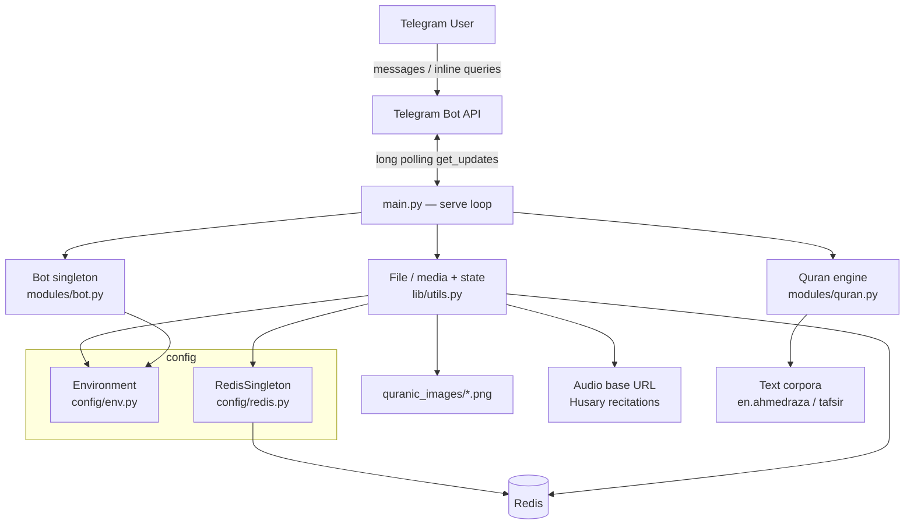
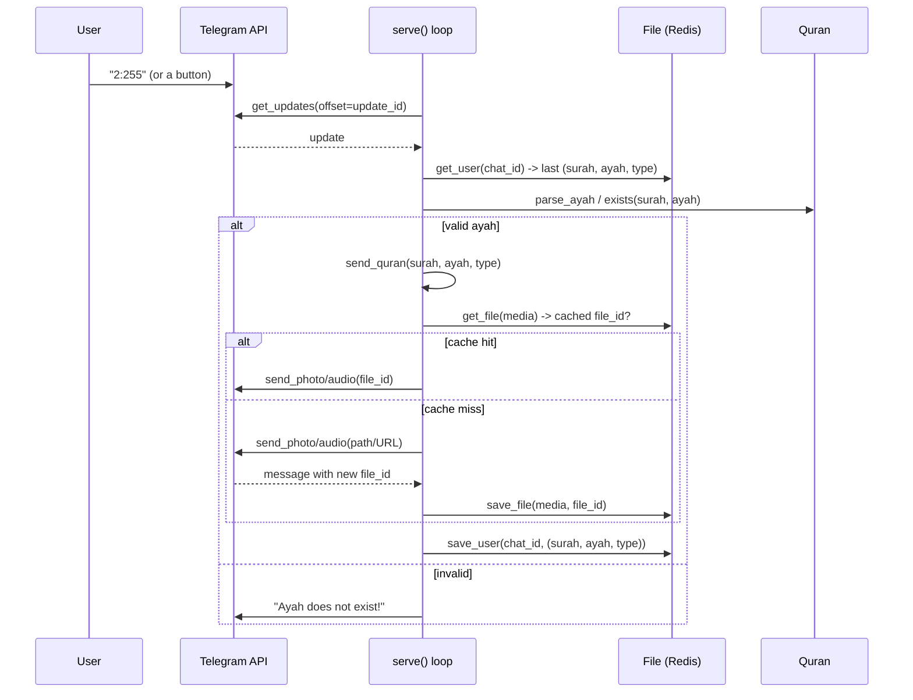

# BismillahBot — Business Logic

> A Telegram bot that lets users explore the Holy Qur'an: English translation,
> Arabic ayah images, audio recitation, and tafsir — via chat commands or
> Telegram inline queries in any chat.

---

## 1. Overview

BismillahBot answers a user with a specific ayah (verse) of the Qur'an in one of
four representations:

| Type      | Delivery              | Source                                             |
| --------- | --------------------- | -------------------------------------------------- |
| `english` | Text message          | `en.ahmedraza` (Imam Ahmed Raza, tanzil.net)       |
| `tafsir`  | Text message          | Tafsir al-Jalalayn (`Al_Jalalain_Eng.txt`)         |
| `arabic`  | Photo (rendered ayah) | `quranic_images/{surah}_{ayah}.png`                |
| `audio`   | Audio file            | Husary recitation (`AUDIO_BASE_URL/.../SSSAAA.mp3`) |

The bot remembers each user's **last position** (surah, ayah, type) for 2 days,
so navigation buttons (Previous / Next / Random) and type switches operate
relative to where the user currently is.

---

## 2. Architecture



### Module responsibilities

- **`main.py`** — entrypoint & long-poll loop. Parses updates, routes commands,
  keyboard buttons and `surah:ayah` references, and dispatches sends.
- **`modules/quran.py`** — the `Quran` corpus (parsing, lookup, navigation math,
  bounds checks) plus the `/index` renderer.
- **`modules/bot.py`** — lazily-constructed singleton `telegram.Bot`.
- **`lib/utils.py`** — `File`: user-state persistence, Telegram file-id cache,
  and media path/URL resolution.
- **`config/`** — environment access (`Environment`) and the Redis connection
  singleton (`RedisSingleton`).

---

## 3. Request lifecycle



### Routing rules (in `serve`)

1. **Inline query** → answer with English + Tafsir for a valid `surah:ayah`,
   else a curated set of default ayahs.
2. **Non-text / group chats** (`chat_id < 0`) → ignored.
3. **`/command`** → `start`/`help`, `about`, `index`, `random`.
4. **Keyboard type words** (`english`/`tafsir`/`audio`/`arabic`) → resend the
   current ayah in that representation.
5. **`next`/`previous`/`random`** → move position, then resend in current type.
6. **`surah:ayah` reference** → validate & send with the reply keyboard.

---

## 4. Navigation model

Position is a `(surah, ayah, quran_type)` tuple stored per `chat_id` in Redis.

```mermaid
stateDiagram-v2
    [*] --> Default: no stored state -> (1, 1, english)
    Default --> Positioned: user sends surah:ayah
    Positioned --> Positioned: Next / Previous (wraps 114 <-> 1)
    Positioned --> Positioned: Random
    Positioned --> Positioned: switch type (arabic/audio/english/tafsir)
    Positioned --> [*]: state expires after 2 days
```

- `get_next_ayah` / `get_previous_ayah` wrap around the 114 surahs.
- `exists()` and `surah_lengths` enforce valid bounds (total 6236 ayahs).

---

## 5. Caching strategy

Two independent Redis-backed caches:

| Cache          | Key                      | Value                   | TTL    |
| -------------- | ------------------------ | ----------------------- | ------ |
| User state     | `{chat_id}`              | `[surah, ayah, type]`   | 2 days |
| Media file-ids | `file:{path-or-url}`     | Telegram `file_id`      | 2 days |

The media cache avoids re-uploading the same photo/audio: after the first send,
Telegram returns a reusable `file_id` that later sends reference directly.

---

## 6. Issues fixed in this refactor

| #  | Area                | Problem                                                                 | Fix                                                              |
| -- | ------------------- | ----------------------------------------------------------------------- | --------------------------------------------------------------- |
| 1  | `utils.get_file`    | Read/write used mismatched keys → cache never hit                       | Single `_file_key()` used by both save & get                    |
| 2  | Inline query        | `ayah` reassigned to a string before `get_ayah()` → `TypeError`         | Use a separate `ref` variable for the display string            |
| 3  | Inline query        | `answer_inline_query` not awaited → query never answered                | `await`ed                                                       |
| 4  | `send_file` (audio) | Stray `get_updates()` mid-send consumed/dropped user updates            | Removed                                                         |
| 5  | `get_audio_filename`| `perf` could be undefined (`NameError`); file re-read every request     | Explicit `ValueError`; performers JSON cached in-process        |
| 6  | `serve` loop        | Blocking `time.sleep` stalled the event loop                            | `await asyncio.sleep(...)`                                       |
| 7  | `send_file`         | Telegram v20 `Message` accessed as a dict (`result["photo"]`)           | Attribute access (`result.photo[-1].file_id`)                   |
| 8  | `save_file`         | Dead `message_to_dict` branch + dict/str cache inconsistency            | Cache stores the `file_id` string directly                      |
| 9  | Startup             | `update_id` took the first backlog update → reprocessing                | Start after the most recent (`result[-1].update_id + 1`)        |
| 10 | `Environment`       | `@classmethod` used `self`; rebuilt dict every call; unknown key crash  | Uses `cls`; explicit `KeyError` on unknown names                |
| 11 | `RedisSingleton`    | Not actually a singleton — new connection per instance                  | Real `__new__`-based, thread-safe singleton                     |
| 12 | Regex               | Invalid escape sequences (`\d` in non-raw strings)                      | Raw strings                                                     |
| —  | Cleanup             | Debug `print`s in hot paths; wrong chat action for audio                | Removed prints; `UPLOAD_VOICE`                                   |

---

## 7. Known limitations / tech debt

- **Corpora parsed on every startup** from text files; no precomputed/JSON cache
  loaded at boot (`save_json` exists but is unused).
- **`arabic` Quran text** requires `quran-uthmani.txt`, which is not needed for
  the image-based Arabic delivery but is still referenced in `Quran.__init__`.
- **No structured logging / metrics** — only `print` statements remain for
  request tracing.
- **Single-process long polling** — no horizontal scaling; one bot instance.
- **No automated tests**.

---

## 8. Future roadmap

```mermaid
flowchart LR
    subgraph Phase 1 — Stabilize
      A1[Add unit tests\nnavigation + parsing]
      A2[Structured logging]
      A3[Precompiled corpora cache]
    end
    subgraph Phase 2 — Scale
      B1[Webhook mode\ninstead of long polling]
      B2[Async media prefetch]
      B3[Config validation on boot]
    end
    subgraph Phase 3 — Features
      C1[Multiple translations & reciters]
      C2[Bookmarks / favorites]
      C3[Daily ayah subscription]
      C4[Full-text ayah search]
    end
    subgraph Phase 4 — Platform
      D1[Multi-language UI]
      D2[Analytics dashboard]
      D3[Rate limiting / abuse controls]
    end
    A1 --> B1 --> C1 --> D1
    A3 --> B2
    A2 --> D2
```

### Prioritized backlog

1. **Testing & CI** — cover `parse_ayah`, `get_next/previous_ayah`, bounds, and
   the cache round-trip; add a lint/compile gate.
2. **Webhook delivery** — replace long polling for lower latency and easier
   horizontal scaling.
3. **Reciter & translation selection** — expose `performers.json` choices and
   multiple translations as user preferences (already partially modeled).
4. **Daily ayah subscriptions** — scheduled push of an ayah to opted-in users.
5. **Ayah search** — search translations/tafsir by keyword and return references.
6. **Observability** — structured logs, per-command metrics, error alerting.
7. **Config hardening** — validate all required env vars at startup and fail fast.
