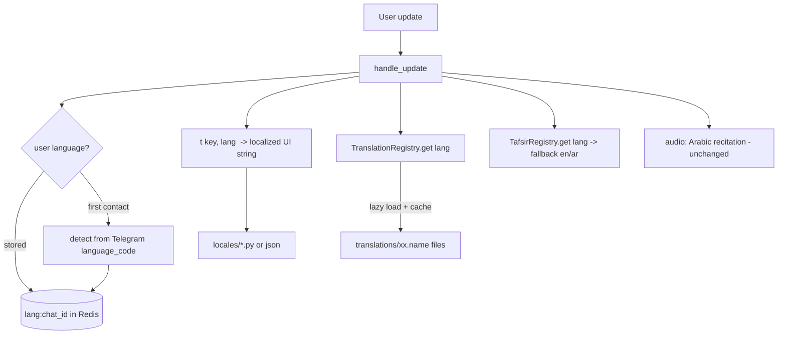
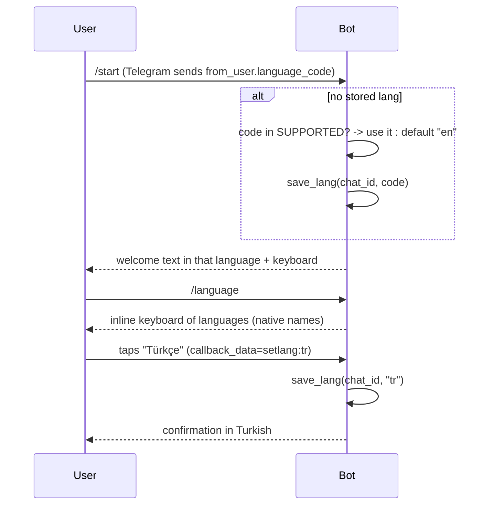

# BismillahBot — Multilingual Support Plan

> A phased plan to make the bot speak the user's language: both its **interface**
> (menus, help, errors) and its **content** (Qur'an translations, and where
> possible tafsir and translated audio).

---

## 1. Goal & scope

Today the bot is **English-only** in every respect: the UI strings, the single
translation (`en.ahmedraza`), and the tafsir (Tafsir al-Jalalayn, English). The
goal is to let a user pick a language once and have the whole experience follow.

"Multilingual" splits into **four independent dimensions** — they can ship
separately, in the order below:

| # | Dimension | Today | Target | Difficulty |
|---|-----------|-------|--------|------------|
| 1 | **UI language** (menus, `/help`, errors, buttons) | English hardcoded | Localized per user | Low |
| 2 | **Translation content** (the ayah text) | `en.ahmedraza` only | Many languages (Urdu, Turkish, Indonesian, French, Russian, …) | Medium |
| 3 | **Tafsir content** | al-Jalalayn (English) | Multilingual where sources exist; else fall back | High (sourcing) |
| 4 | **Audio** | Arabic recitation (Husary) | Optionally translated recitations | Medium |

Audio note: the **recitation is Arabic and language-independent**, so dimension 4
is optional — but `common/performers.json` already lists translated recitations
(English Sahih Intl, Persian, Urdu, Bosnian, Azerbaijani), so it's low-hanging
fruit later.

---

## 2. Current-state audit (what is hardcoded English)

Everything that must become language-aware, by location:

- **UI strings** in [src/main.py](src/main.py):
  - `/start` & `/help` text, `/about` text — English prose.
  - Reply keyboard labels: `Arabic`, `Audio`, `English`, `Tafsir`, `Previous`, `Random`, `Next` (in `build_data`).
  - `"Ayah does not exist!"` and the range-too-large message.
  - The button-matching logic (`if message in ("english","tafsir","audio","arabic")`, `("next","previous","random")`) — **matches English words**, so translating the buttons breaks it (see §7).
- **Content loading** in [src/modules/quran.py](src/modules/quran.py):
  - `Quran("translation")` hardcodes `en.ahmedraza`; `Quran("tafsir")` hardcodes `Al_Jalalain_Eng.txt`.
  - `surah_names` uses the `tname` (transliteration) attribute from `quran-data.xml` — note that file **also has `name` (Arabic) and `ename` (English)**, so localized surah names are partly free.
- **User state** in [src/lib/utils.py](src/lib/utils.py):
  - `save_user(chat_id, (surah, ayah, type))` — **no language field**.
- **Inline queries** in [src/main.py](src/main.py): always return English + Tafsir.
- **Telegram command menu**: not set per-language (`setMyCommands` unused).

---

## 3. Target architecture



Three new pieces, each small and isolated:

1. **`locales/`** — UI string tables per language + a `t(key, lang)` helper.
2. **`TranslationRegistry`** — lazy-loads Qur'an translations on first use, keyed by language, cached in memory.
3. **Language preference** — stored per user, detected on first contact, changed via `/language`.

---

## 4. User language preference

### Storage
Store language **separately** from navigation state, because it is a durable
preference while `(surah, ayah, type)` resets after 2 days:

| Key | Value | TTL |
|-----|-------|-----|
| `lang:{chat_id}` | ISO-639-1 code (`en`, `ur`, `tr`, …) | none / long |
| `{chat_id}` (existing) | `[surah, ayah, type]` | 2 days (unchanged) |

New helpers in [src/lib/utils.py](src/lib/utils.py): `save_lang(chat_id, code)` /
`get_lang(chat_id)`. (Both work with the in-memory fallback store already in place.)

### Detection & selection flow



- **Auto-detect** from `update.message.from_user.language_code` (Telegram sends
  e.g. `tr`, `ur`, `en-US`). Take the primary subtag, use it if supported, else `en`.
- **`/language` command** → inline keyboard (native names, e.g. `اردو`, `Türkçe`,
  `Bahasa Indonesia`) with `callback_data = "setlang:<code>"`.
- Requires a **`CallbackQueryHandler`** — currently the app only handles messages
  and inline queries, so add `update.callback_query` handling in `handle_update`.

---

## 5. Content: multi-translation loading (memory-aware)

The free Koyeb instance is **512 MB and ~0.1 vCPU**, so we must **not** parse every
translation at startup. Design a **lazy registry**:

```python
class TranslationRegistry:
    """Loads and caches Qur'an translations on demand, one per language."""
    _cache: dict[str, Quran] = {}

    @classmethod
    def get(cls, lang: str) -> Quran:
        if lang not in cls._cache:
            spec = TRANSLATIONS.get(lang, TRANSLATIONS["en"])  # fallback
            cls._cache[lang] = Quran.from_file(spec.path)      # parse once
        return cls._cache[lang]
```

- **Only English is preloaded** (in `build_data`); every other language is parsed
  on first request and then cached — startup stays fast, memory grows only with
  languages actually used.
- Each translation file is ~1–2 MB of text (~6236 verses); a handful cached is
  well within budget. If memory ever tightens, add a simple LRU cap.
- Refactor `Quran.__init__` into a `Quran.from_file(path)` classmethod so it isn't
  tied to the three hardcoded names.

### Translation catalogue (initial set)
Sourced from **tanzil.net** (same `surah|ayah|text` format the existing
`parse_quran` already reads):

| Lang | Code | Suggested tanzil file | RTL |
|------|------|-----------------------|-----|
| English | `en` | `en.ahmedraza` (have) / `en.sahih` | no |
| Arabic (original) | `ar` | `quran-simple` / images | RTL |
| Urdu | `ur` | `ur.jalandhry` | RTL |
| Turkish | `tr` | `tr.diyanet` | no |
| Indonesian | `id` | `id.indonesian` | no |
| French | `fr` | `fr.hamidullah` | no |
| Russian | `ru` | `ru.kuliev` | no |
| Bengali | `bn` | `bn.bengali` | no |
| Persian | `fa` | `fa.makarem` | RTL |
| Hindi | `hi` | `hi.farooq` | no |

RTL text (Arabic/Urdu/Persian) renders correctly in Telegram automatically — no
special handling needed.

> **Licensing:** tanzil.net translations each carry their own terms. Before
> bundling, record each translation's license/attribution in an `ATTRIBUTIONS.md`
> and surface it in `/about`. This is a **release blocker**, not an afterthought.

---

## 6. UI internationalization (i18n)

Keep it dependency-free and simple — a dict of dicts:

```
src/locales/
  __init__.py     # t(key, lang) -> str, with English fallback
  en.py           # {"welcome": "...", "btn_translation": "Translation", ...}
  tr.py
  ur.py
  ...
```

```python
def t(key: str, lang: str) -> str:
    return LOCALES.get(lang, LOCALES["en"]).get(key) or LOCALES["en"][key]
```

- Every user-facing string in `handle_update` becomes `t("key", lang)`.
- **Missing keys fall back to English**, so a partially-translated language still works.
- Keep keys stable and few: `welcome`, `help`, `about`, `ayah_not_found`,
  `range_too_large`, `choose_language`, `language_set`, plus button labels.

---

## 7. The keyboard & command localization challenge

**The hard part.** The reply keyboard is matched by **English text**:
`if message in ("english","tafsir","audio","arabic")`. If we localize the button
labels, incoming button text will be e.g. `"Tercüme"` (Turkish) and won't match.

Two options:

- **Option A — reverse-map localized labels → action (smaller change).**
  Build the keyboard with `t()` labels, and maintain a per-language
  `{localized_label_lower: action}` map to translate taps back to canonical
  actions (`translation`, `tafsir`, `arabic`, `audio`, `next`, `previous`, `random`).
  Keeps the existing reply-keyboard UX.

- **Option B — switch content/nav buttons to inline keyboards with `callback_data` (cleaner, bigger change).**
  `callback_data` is language-independent (`act:next`, `act:translation`), so no
  reverse mapping is ever needed. Requires the `CallbackQueryHandler` we already
  need for `/language`, and reworks how the current reply keyboard is presented.

**Recommendation:** Option A for v1 (least disruption), migrate to Option B later.

Also relabel the content buttons conceptually: **`English` → `Translation`** (in
the user's language), since it's no longer always English. `Arabic` (image),
`Audio`, `Tafsir` stay as concepts.

### Telegram command menu
Localize the slash-command menu with **`setMyCommands(commands, language_code=…)`**
once per supported language at startup (alongside `set_webhook`). Add a
`/language` command entry.

---

## 8. Tafsir & audio (later dimensions)

- **Tafsir:** al-Jalalayn exists mainly in Arabic and English. Multilingual tafsir
  sources are scarce, so: keep tafsir **English (or Arabic) with a clear fallback
  note** in v1; add other languages only where a clean source exists. Model it with
  a `TafsirRegistry` mirroring the translation one, but with **fallback to `en`**
  when the user's language has no tafsir.
- **Audio:** offer translated recitations from the existing `performers.json`
  (English Sahih Intl, Persian, Urdu). Add a per-user "reciter/audio language"
  preference. Purely additive — the Arabic Husary default stays.

---

## 9. Phased roadmap

```mermaid
flowchart LR
    subgraph P1[Phase 1 — UI i18n]
      A1[locales/ + t helper]
      A2[lang preference storage + detect]
      A3[/language command + callback handler]
      A4[localized keyboard - Option A]
    end
    subgraph P2[Phase 2 — Translations]
      B1[Quran.from_file refactor]
      B2[TranslationRegistry lazy-load]
      B3[bundle 3-5 translations + licenses]
      B4[inline query in user language]
    end
    subgraph P3[Phase 3 — Polish]
      C1[setMyCommands per language]
      C2[localized surah names in index]
      C3[more translations]
    end
    subgraph P4[Phase 4 — Content depth]
      D1[tafsir fallback registry]
      D2[translated audio option]
      D3[inline-keyboard nav - Option B]
    end
    A1-->A2-->A3-->A4-->B1-->B2-->B3-->B4-->C1-->C2-->C3-->D1-->D2-->D3
```

**Phase 1 delivers visible value alone** (the bot speaks the user's language even
while still showing the English translation), so it's a good first ship.

---

## 10. File-by-file change list

| File | Change |
|------|--------|
| `src/locales/` (new) | UI string tables + `t(key, lang)` |
| [src/lib/utils.py](src/lib/utils.py) | `save_lang` / `get_lang`; keep nav state separate |
| [src/modules/quran.py](src/modules/quran.py) | `Quran.from_file(path)` classmethod; `TranslationRegistry`; optional localized surah names |
| [src/main.py](src/main.py) | resolve `lang` per update; wrap UI strings in `t()`; `/language` + `callback_query` handling; localized keyboard + reverse-map; `setMyCommands` per language at startup; inline query in user's language |
| `translations/` (new) | bundled tanzil translation files |
| `ATTRIBUTIONS.md` (new) | per-translation license/attribution; linked from `/about` |
| `.env.example` | `DEFAULT_LANG` (optional), `SUPPORTED_LANGS` (optional) |

No changes needed to the Redis layer — the existing store (and its in-memory
fallback) already supports the new keys.

---

## 11. Memory & performance (free-tier reality)

- **Lazy-load translations** (§5) — never parse all languages at boot; parse on
  first use, cache thereafter. Keeps the fast non-blocking startup we already have.
- Optionally cap the translation cache (LRU) if many languages get used.
- UI locale tables are tiny (a few KB each) — load all at import, no concern.
- Keep the existing **background-init** pattern so corpora/translation parsing
  never blocks health checks.

---

## 12. Testing

- **Unit:** `t()` fallback (missing key → English), language detection
  (`en-US` → `en`, unsupported → `en`), `TranslationRegistry` caching, reverse
  button-map per language, `save_lang`/`get_lang` round-trip (incl. in-memory store).
- **Content integrity:** each bundled translation passes the existing
  `sum(len(s)) == 6236` assertion in `parse_quran`.
- **Manual:** switch language via `/language`, verify menu/help/errors/buttons and
  the ayah translation all change; verify RTL languages render; verify inline query
  respects `from_user.language_code`.

---

## 13. Risks & open questions

- **Button reverse-mapping fragility** (Option A) — a stopgap; plan the Option B
  inline-keyboard migration.
- **Translation licensing** — must be cleared before bundling (release blocker).
- **Memory creep** if many languages are used at once — mitigated by lazy-load + optional LRU.
- **Surah-name localization** — `quran-data.xml` gives Arabic/English/translit for
  free; other languages need a localized name list (nice-to-have, not blocking).
- **Open:** default when Telegram sends an unsupported `language_code` — plan says
  fall back to English; confirm that's desired vs. prompting the user to choose.
- **Open:** should `/language` also switch the **audio reciter language**, or keep
  audio always-Arabic with a separate setting? (Recommend separate.)

---

## 14. Recommended first step

Ship **Phase 1** (UI i18n + language preference + `/language`) with the
translation still English. It's self-contained, low-risk, needs no new bundled
data or licensing clearance, and immediately makes the bot feel native to
non-English users — then layer translations on top in Phase 2.
